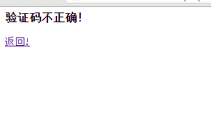
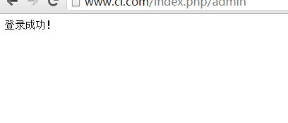

# 第五节 后台登录


后台登录要点有二。
1.验证码
2.表单验证

先来说第一个，生成验证码。
CI有生成验证码辅助函数captcha，手册里的例子居然是生成保存图片，然后通过图片生成时间与验证时间的差值来验证，也没清空文件夹里图片，我表示无法理解。。。详细请看手册[验证码辅助函数][1]

弃之，用之前*saiphp*里的验证码类。
([可查看saiphp][2])

就是GD库写的生成图片，也比较简单就不多说明了。代码如下：
```php
<?php
defined('BASEPATH') OR exit('No direct script access allowed');

// 验证码

if ( ! function_exists('createCode'))
{
	function createCode($num, $w, $h, $type = '', $filename = ''){
		//创建图片
	    $image = imagecreatetruecolor($w, $h);
	    
	    $bgcolor = imagecolorallocate($image,235,255,255); 
	    imagefill($image, 0, 0, $bgcolor);
	    
	    $fontcolor = imagecolorallocate($image, rand(0,120),rand(0,120), rand(0,120));
	    imagestring($image, 5, 15, 5, $num, $fontcolor);

	    //生成干扰点
	    for($i=0;$i<50;$i++){
	        $pointcolor = imagecolorallocate($image,rand(50,200), rand(50,200), rand(50,200));        
	        imagesetpixel($image, rand(1,99), rand(1,29), $pointcolor);
	    }

	    //输出图片
	    if (empty($type)) $type = 'png';
	    header("Content-type: image/" . $type);
        $ImageFun = 'image' . $type;
        if (empty($filename)) {
            $ImageFun($image);
        } else {
            $ImageFun($image, $filename);
        }
        //销毁图片
        imagedestroy($image);
	}
}
```


> 因为其他地方可能用到，保存为image_helper存入system\helpers。

我们只是做个简单的博客，所以就不单独分模块了。
在application/controllers里新建文件夹admin，用于存放后台的控制器。
在application/views里同样新建文件夹admin，用于存放后台视图。
模型就不新建了，公用即可。

>注： 如果你先讲后台单独出来，你可以复制application后命名为admin，复制入口index.php为admin，修改必要参数，这样前后台模块就完全分隔开了。

后台控制器：
```php
<?php
defined('BASEPATH') OR exit('No direct script access allowed');

class article extends CI_Controller {

	public function __construct(){
        parent::__construct();
        $this->load->model('articleModel');
        $this->load->helper('url');//载入url helper
		$this->load->library('pagination');//载入pagination
		$this->load->library('session');//载入pagination
    }
    
    public function code($w, $h){
	    $arr = array();
	    $num = rand(1000,9999);
	    $_SESSION['code'] = $num;
        $this->load->helper('image');
        createCode($num,$w,$h);
    }
}
```

验证CI同样有辅助函数，详细请看[手册表单验证辅助函数][3]，测试了下，效果还不错，但我还是直接用h5来验证，但提示借鉴其方法。
视图：
```html
<div class="log"> 
  <div class="am-g">
  <div class="am-u-lg-3 am-u-md-6 am-u-sm-8 am-u-sm-centered log-content">
    <h1 class="log-title am-animation-slide-top">13sai</h1>
    <br>
    <form class="am-form" id="log-form" method="post" action="">
      <div class="am-input-group am-radius am-animation-slide-left">       
        <input type="text" id="doc-vld-email-2-1" class="am-radius" placeholder="用户名" name="user" required/>
        <span class="am-input-group-label log-icon am-radius"><i class="am-icon-user am-icon-sm am-icon-fw"></i></span>
      </div>      
      <br>
      <div class="am-input-group am-animation-slide-left log-animation-delay">       
        <input type="password" class="am-form-field am-radius log-input" placeholder="密码" name="pw"  required>
        <span class="am-input-group-label log-icon am-radius"><i class="am-icon-lock am-icon-sm am-icon-fw"></i></span>
      </div>     
      <br>    
      <div class="am-input-group am-animation-slide-left log-animation-delay">       
        <input type="text" class="am-form-field am-radius log-input" placeholder="验证码" name="code" required>
        <span class="am-input-group-label log-icon am-radius"></span>
      </div>      
      <br>
      <button type="submit" class="am-btn am-btn-primary am-btn-block am-btn-lg am-radius am-animation-slide-bottom log-animation-delay">登 录</button>
    </form>
  </div>
  </div>
</div>
<?php $this->load->view('admin/footer') ?>
</body>
</html>
```
模型：
```php
//为了复用，增加一个参数表示查找的字段
public function getArticle($table, $id, $index = ''){
	$index = $index == ''? 'id' : $index;
	$data = $this->db->where("$index=",$id)->get($table);
	return $data->result()[0];
}
```
控制器：
```php
    public function index(){
        if($_POST){
            $code = $_POST['code'];
            if($code != $_SESSION['code']){
                $arr['info'] = '验证码不正确！';
                $arr['url'] = 'admin';
                $data['arr'] = $arr;
                $this->load->view('admin/tips',$data);
            }else{
	            $user = $_POST['user'];
	            $pw = $_POST['pw'];
	            $admin = $this->articleModel->getArticle('admin', $user, 'user');
	            if(md5($pw) == $admin->password){
		            echo "<meta charset='utf-8'/>登录成功！";
	            }else{
		            $arr['info'] = '用户名或密码错误！';
	                $arr['url'] = 'admin';
	                $data['arr'] = $arr;
	                $this->load->view('admin/tips',$data);
	            }
            }
	            
        }else{
            $this->load->view('admin/header');
            $this->load->view('admin/index');
        }
    }
```
看看效果：





好，我们登录就完成了。

> 注：有时候框架不好用的，自己觉得有更好办法的，果断去用自己的办法。当然，也许是自己学得不够深，运用CI还没有那么熟练，所以觉得不好用，或许你会有更好的解决办法。

  [1]: http://codeigniter.org.cn/user_guide/helpers/captcha_helper.html "验证码函数"
  [2]: https://github.com/13sai/saiphp "saiphp"
  [3]: http://codeigniter.org.cn/user_guide/helpers/form_helper.html
