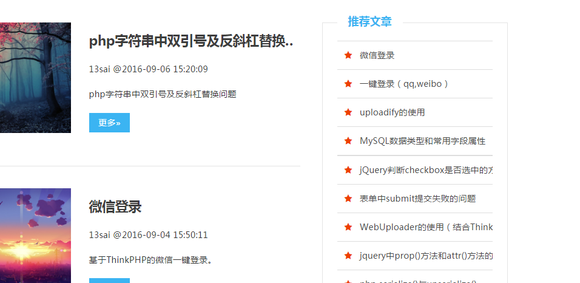

# 第七节  完善博客平台


前六章，我们已经搭建出了一个简单的博客发布平台，可以实现基本功能。但是，平台还有很多不完善的地方，比如后台增删改查的权限，前台搜索功能，导航栏增加等等。

这一章，我们就来完善这些功能。

## 增加权限：
增加一个验证登录的函数
```php
public function checkLogin(){
    $user = $this->session->userdata('user');
    if(empty($user)) redirect('admin');
}
```

然后在增删改查的方法里加入：
```php
$this->checkLogin();
```

这里有个知识点，session类。
使用方法简单。
首先引入session类，
```php
$this->load->library('session');
```
## 后台各种链接
left.php
```html
<?php $this->load->view('admin/header') ?>
<header class="am-topbar admin-header">
  <h1 class="am-topbar-brand">
    <i class="am-header-icon am-icon-bars"></i>  后台管理
  </h1>
  <div class="am-collapse am-topbar-collapse" id="doc-topbar-collapse">
    <div class="am-topbar-right">
      <button class="am-btn am-btn-primary am-topbar-btn am-btn-sm" onclick="window.location.href='/index.php/admin/article/logout'">退出</button>
    </div>
  </div>
</header>
<div class="admin-main">
	<div class="admin-sidebar am-hide-sm-only">
		<ul class="am-list admin-sidebar-list">
			<li>
			<?php
				echo anchor('/','<i class="am-icon-home"></i> 首页')
			?>
			</li>
			<li>
			<?php
				echo anchor('admin/article/lists','<i class="am-icon-list"></i> 列表')
			?>
			</li>
			<li>
			<?php
				echo anchor('admin/article/creat','<i class="am-icon-plus"></i> 发布')
			?>
			</li>
		</ul>
	</div>
	<div class="admin-content">
```
## 前台导航与搜索
控制器
```php
public function type($type){
    $config['base_url'] = site_url('article/type/'.$type);
    $config['use_page_numbers'] = true;
    $con['type'] = $type;
    //var_dump($limit);die();
    $config['total_rows'] = $this->articleModel->countArticles('article',$con);//数据总条数
    $config['per_page']= 6;//每页显示条数
    $this->pagination->initialize($config);
    $limit['num'] = $config['per_page'];
    $page = $this->uri->segment(4);
    $page = isset($page) ? $page - 1 : 0;
    //echo $page;die();
    $limit['offset'] = $page * $limit['num'];
    $limit['type'] = $con;
    $data['article'] = $this->articleModel->getLimitArticles('article',$limit);
    
    $data['title'] = array('id'=>2);
    $data['arr'] = array('12','10','19','22','20');
    
    $this->load->view('header');
    $this->load->view('index', $data);
    $this->load->view('footer');
}

public function search(){
    $title = $this->input->get('title');
    $config['base_url'] = site_url('article/search/'.$title);
    
    $config['use_page_numbers'] = true;
    $con['title'] = $title;
    //var_dump($con);die();
    $config['total_rows']= $this->articleModel->countArticles('article',$con);//数据总条数
    $config['per_page']= 6;//每页显示条数
    
    $this->pagination->initialize($config);
    
    $limit['num'] = $config['per_page'];
    $page = $this->uri->segment(4);
    $page = isset($page) ? $page - 1 : 0;
    //echo $page;die();
    $limit['offset'] = $page * $limit['num'];
    $limit['con'] = $con;
    $data['article'] = $this->articleModel->getLimitArticles('article',$limit);
    
    $data['title'] = array('id'=>2);
    $data['arr'] = array('12','10','19','22','20');
    
    $this->load->view('header');
    $this->load->view('index', $data);
    $this->load->view('footer');
}
```
模型
```php
public function countArticles($table,$type = array()){
    if(!empty($type))$this->db->like($type);
	$this->db->from($table);
	return $this->db->count_all_results();
	//return $this->db->count_all($table);
}

public function getLimitArticles($table, $arr=array('num'=>false,'offset'=>false,'con'=>array())){
    if(isset($arr['num']) and isset($arr['offset']) and ($arr['num']!==false) and ($arr['offset']!==false)){
        if(!empty($arr['con'])) $this->db->like($arr['con']);
        $query = $this->db->order_by('id','desc')->get($table,$arr['num'],$arr['offset']);
        return $query->result_array();
    }else{
        return $this->getArticles($table);
    }
}

public function getArticle($table, $id, $index = ''){
    $index = $index == ''? 'id' : $index;
    $data = $this->db->where("$index=",$id)->get($table);
    return $data->row_array();
}
```
## 文章内页
第一篇文章和最后一篇文章会报错，我们需要加上是否为空数组的判断。


## 推荐文章到首页
这个比较简单，就是普通的查找。如图：


    至此，我们制作出了一个简单的博客平台就完工了。必然有很多不完善的地方，你可以自己加以完善，做出自己的博客或是CMS。

##后面几节，我们来总结一下，并学习CI常用的一些知识点。

#PS:session类
###添加 Session 数据
假设某个用户访问你的网站，当他完成认证之后，你可以将他的用户名和 email 地址添加到 session 中， 这样当你需要的时候你就可以直接访问这些数据，而不用查询数据库了。

你可以简单的将数据赋值给 $_SESSION 数组，或赋值给 $this->session 的某个属性。

同时，老版本中的通过 "userdata" 来赋值的方法也还可以用，只不过是需要传递一个包含你的数据的数组 给 set_userdata() 方法:
```php
$this->session->set_userdata($array);
```
其中，$array 是包含新增数据的一个关联数组，下面是个例子:
```php
$newdata = array(
    'username'  => 'johndoe',
    'email'     => 'johndoe@some-site.com',
    'logged_in' => TRUE
);

$this->session->set_userdata($newdata);
```
如果你想一次只添加一个值，set_userdata() 也支持这种语法:
```php
$this->session->set_userdata('some_name', 'some_value');
```
如果你想检查某个 session 值是否存在，可以使用 isset():
```php
// returns FALSE if the 'some_name' item doesn't exist or is NULL,
// TRUE otherwise:
isset($_SESSION['some_name']);
```
或者，你也可以使用 has_userdata():
```php
$this->session->has_userdata('some_name');
```

###获取 Session 数据
session 数组中的任何信息都可以通过 $_SESSION 全局变量获取:
```php
$_SESSION['item']
```
或使用下面的方法（magic getter）:
```php
$this->session->item
```
同时，为了和之前的版本兼容，也可以使用 userdata() 方法:
```php
$this->session->userdata('item');
```
其中，item 是你想获取的数组的键值。例如，将 'name' 键值对应的项赋值给 $name 变量， 你可以这样:
```php
$name = $_SESSION['name'];
// or:
$name = $this->session->name
// or:
$name = $this->session->userdata('name');
```

如果你访问的项不存在，userdata() 方法返回 NULL 。
如果你想获取所有已存在的 userdata ，你可以忽略 item 参数:
```php
$_SESSION
// or:
$this->session->userdata();
```

###删除 Session 数据
和其他的变量一样，可以使用 unset() 方法来删除 $_SESSION 数组中的某个值:
```php
unset($_SESSION['some_name']);
// or multiple values:
unset(
    $_SESSION['some_name'],
    $_SESSION['another_name']
);
```
同时，正如 set_userdata() 方法可用于向 session 中添加数据，unset_userdata() 方法可用于删除指定键值的数据。例如，如果你想从你的 session 数组中删除 'some_name':
```php
$this->session->unset_userdata('some_name');
```
这个方法也可以使用一个数组来同时删除多个值:
```php
$array_items = array('username', 'email');
$this->session->unset_userdata($array_items);
```
